---
kernelspec:
  name: python
  display_name: Python 3
---

# GeoGebra: Uvod

:::{code-cell} python
:tags: remove-input
import IPython.display as display
from IPython.display import IFrame
:::

## Kaj je Geogebra?

[Geogebra](https://www.geogebra.org/) je brezplačno dinamično matematično orodje, ki omogoča raziskovanje in vizualizacijo različnih matematičnih konceptov.

Trenuto, Geogebra je popoln paket za učenje in poučevanje matematike. Ponuja različne aplikacije, ki pokrivajo področja, kot so geometrija, algebra, statistika in kalkulus.
Vse te aplikacije je mogoče namestiti lokalno ali dostopati do njih prek spleta:

- [Scientific Calculator](https://www.geogebra.org/scientific): Za izračune z ulomki, statistiko in osnovnimi matematičnimi funkcijami.
- [Graphing Calculator](https://www.geogebra.org/graphing): Za vizualizacijo enačb in funkcij z interaktivnimi grafikoni.
- [Geometry](https://www.geogebra.org/geometry): Za dinamične geometrijske koncepte in konstrukcije v ravnini.
- [3D Calculator](https://www.geogebra.org/3d): Za raziskovanje tridimenzionalnih oblik in površin.
- [CAS Calculator](https://www.geogebra.org/cas): Za simbolne izračune in reševanje enačb.
- [Calculator suit](https://www.geogebra.org/calculator): Kombinacija različnih orodij za širok spekter matematičnih nalog. Idealna za učence in študente.
- [Geogebra Classic](https://www.geogebra.org/classic): Vse-v-enem aplikacija, ki združuje vse zgoraj omenjene funkcije. Idealna za avtorije učnih gradiv.

Različne možnosti, ki jih ponuja vsako od orodij, so navedene v [Tabeli 1](#tab_geogebra-apps).

:::{list-table} Primerjava različnih aplikacij Geogebra
:header-rows: 1
:label: tab_geogebra-apps

   * - aplikacije / funkcije 
     - Scientific
     - Graphing
     - Geometry
     - 3D
     - CAS
     - Suit
     - Classic
   * - Numerični izračuni
     - ✓
     - ✓
     - ✓
     - ✓
     - ✓
     - ✓
     - ✓
   * - Funkcije
     - ✓
     - ✓
     - ✓
     - ✓
     - ✓
     - ✓
     - ✓
   * - Operacije z ulomki
     - ✓
     - ✓
     - ✓
     - ✓
     - ✓
     - ✓
     - ✓
   * - Grafično prikazovanje
     - 
     - ✓
     - ✓
     - ✓
     - ✓
     - ✓
     - ✓
   * - Drsniki
     - 
     - ✓
     - ✓
     - ✓
     - ✓
     - ✓
     - ✓
   * - Vektorji in matrike
     - 
     - ✓
     - ✓
     - ✓
     - ✓
     - ✓
     - ✓
   * - Tabele
     - 
     - ✓
     - 
     - 
     - ✓
     - ✓
     - ✓
   * - Geometrijske konstrukcije
     - 
     - 
     - ✓
     - ✓
     - ✓
     - ✓
     - ✓
   * - 3D prikazovanje
     - 
     - 
     - 
     - ✓
     - 
     - ✓
     - ✓
   * - Verjetnost in statistika
     - 
     - 
     - 
     - 
     - 
     - ✓
     - ✓
   * - Odvodi in integrali
     - 
     - 
     - 
     - ✓
     - ✓
     - ✓
     - ✓
   * - Reševanje enačb
     - 
     - 
     - 
     - ✓
     - ✓
     - ✓
     - ✓
   * - Simbolni izračuni
     - 
     - 
     - 
     - ✓
     - ✓
     - ✓
     - ✓
   * - Spreadsheets
     - 
     - 
     - 
     - 
     - 
     - 
     - ✓
:::

Mi bomo v nadaljevanju uporabljali predvsem [Geogebra Classic](https://www.geogebra.org/classic), saj omogoča uporabo vseh orodij na enem mestu.

## Kako začnemo z Geogebro?

Geogebra lahko uporabimo na dva načina: prek spletnega brskalnika ali z namestitvijo aplikacije na računalnik (ali telefon/tablet).

V vsakem primeru bomo uporabili račun Geogebra, ki nam omogoča shranjevanje naših delovnih zvezkov v oblak in dostop do njih od kjerkoli. 

:::{exercise}
:label: ex_geogebra-account
Ustvarite račun Geogebra.
:::

:::{solution} ex_geogebra-account
:class: dropdown
1. Obiščite [spletno stran Geogebra](https://www.geogebra.org/).
2. Kliknite na "Sign in" gumb v zgornjem desnem kotu strani.
3. Izberite "Create account".
4. Izberite način registracije (prek e-pošte ali z uporabo obstoječega računa, npr. Google, Microsoft, Office 365).
:::

Zdaj imate dve možnosti za začetek uporabe Geogebre:
1. **Uporaba spletnega brskalnika**:
	 - Obiščite [Geogebra Classic](https://www.geogebra.org/classic).
	 - Kliknite na gumn   _Menu_ v zgornjem levem kotu.
	 - Prijavite se s svojim računom z klikom na   _Sign in_.
2. **Namestitev aplikacije**:
	 - Prenesite aplikacijo Geogebra Classic za vaš operacijski sistem z [uradne strani za prenos](https://geogebra.github.io/docs/reference/en/GeoGebra_Installation/#_geogebra_classic_6).
	 - Namestite aplikacijo in jo odprite.
	 - Prijavite se s svojim računom z klikom na gumb  _Menu_  v zgornjem levem kotu in nato na  _Sign in_ .	 
	 
Ko odprete Geogebro in se prijavite, boste videli glavno delovno okolje. Privzeto je prikazi 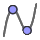_Graf_ (ang. _Graphing perspective_), ki omogoča risanje funkcij in geometrijskih objektov. Lahko jo vidite tudi spodaj:

:::{code-cell} python
:tags: remove-input
IFrame("https://www.geogebra.org/material/iframe/id/bmkqk4ju/width/1280/height/720/border/3C82F6/sfsb/true/smb/true/stb/true/stbh/true/ai/true/asb/true/sri/true/rc/true/ld/true/sdz/true/ctl/true/szb/true", width="600", height="340px", allowfullscreen=True)
:::

:::{note} Opomba.
_Graphing perspective_ je eden izmed več prikazi, ki jih ponuja Geogebra. Vsaka aplikacija Geogebre je sestavljena iz različnih prikazov, tako da lahko ustvarimo gradiva za različne aplikacije.
Različne prikaze lahko izberemo s klikom na gumb  _Menu_ v zgornjem levem kotu in nato izbiro možnosti  _Perspectives_.
:::

Vsak prikaz ponuja različne _poglede_ (ang, _views_).
Lahko jih dodamo ali odstranimo glede na naše potrebe s klikom na gumb  _Menu_ v zgornjem levem kotu in nato izbiro možnosti  _View_.
Različni pogledi vključujejo:
-  _Algebrsko okno_ (ang. 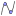_Algebra_).
-  _Simbolno računanje_ (ang. _CAS_).
- 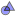 _Risalna površina_ (ang. _Graphics_).
-  _Grafika 2_ (ang. 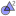_Graphics 2_).
- 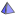 _3d grafika_ (ang. _3D Graphics_).
-  _Preglednica_ (ang. _Spreadsheet_).
-  _Računanje verjetnosti_ (ang. _Probability Calculator_).

Drugi vnosi nad gumbom  _Menu_ omogočajo dostop do različnih orodij in nastavitev Geogebre, kot so:
-  _Datoteka_ (ang. _File_): Ustvarjanje, odpiranje, shranjevanje in izvoz datotek.
-  _Uredi_ (ang. _Edit_): Razveljavi, ponovi, kopiraj, prilepi in druge osnovne funkcije urejanja.
-  _Nastavitev_ (ang. _Settings_): Prilagajanje nastavitev Geogebre, kot so jezika, velikosti pisave in drugih možnosti.
-  _Orodja_ (ang. _Tools_): Dostop do različnih orodij za risanje in konstrukcije.
-  _Pomoč_ (ang. _Help and Feedback_): Dostop do dokumentacije, vadnic in podpore skupnosti Geogebra.
-  _Račun_ (ang.  _Account_): Prijava in odjava iz računa Geogebra.

:::{warning} Opomba
Geogebra se lahko uporablja v slovenskem jeziku, vmesnik je preveden, prav tako pa tudi ukazi, žal pa ni dokumentacije v slovenskem jeziku za ukaze (ki jih uporabljamo za ustvarjanje gradiva). Zaradi tega bomo vmesnik ohranili v angleščini, vendar upoštevajte, da če želite Geogebro uporabljati z otroki ali učenci, lahko jezik spremenite v meniju _Settings_.
:::

Poleg gumba  _Menu_, pomembni del orodjarne so tudi:

:::{list-table}

* - *Orodarne* (ang. *Toolbar*):
  -  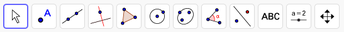
* - *Slog vrstica* (ang. *Stylebar*):
  -  
* - *Razveljavi* (ang. *Undo*):
  -  
* - *Ponovno naredi* (ang. *Redo*):
  -  
:::

## Orodje

Geogebra ponuja širok nabor orodij za ustvarjanje in manipulacijo matematičnih objektov. Orodja so dostopna prek orodjarne (ang. _Toolbar_), ki se nahaja običajno na vrhu zaslona.
Orodjarna je odvisna od izbranega prikaza in ponuja različna orodja glede na kontekst.
Za zdaj, mi bomo raziskali nekaj osnovnih orodij, ki so na voljo v privzetem prikazu _Graphing_ in v prikazu _Graphics_, in sicer:
:::{image} ./geogebra/images/344px-Toolbar-Graphics.png
:::

V nadelevanju opisujemo nekatere najpogosteje uporabljena orodja, celoten seznam orodij pa najdete v [dokumentaciji Geogebre](https://geogebra.github.io/docs/manual/en/).

::::{dropdown} 
:::{list-table}
:header-rows: 1
* - Orodje
  - 
  - Opis
* -  
  - *Izbira in premikanje* (ang. *Move*) 
  - Omogoča izbiro in premikanje objektov v grafičnem prostoru.
:::
::::

::::{dropdown}
:::{list-table}
:header-rows: 1
* - Orodje
  -
  - Opis
* -  
  - *Točka* (ang. *Point*) 
  - Ustvari posamezno točko na določenem mestu.
* -  
  - *Točka na objektu* (ang. *Point on Object*) 
  - Ustvari točko, ki leži na izbranem objektu, kot je premica ali krog.
* -  
  - *Točka presečišča* (ang.  *Intersect*) 
  - Ustvari točko na presečišču dveh izbranih objektov.
* -  
  - *Sredina ali središče* (ang. *Midpoint or Center*) 
  - Ustvari točko, ki predstavlja sredino daljice ali središče kroga.
* - 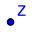 
  - *Kompleksa števila* (ang. *Complex Number*)
  - Ustvari točko, ki predstavlja kompleksno število v kompleksni ravnini.
* - 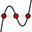 
  - *Ničle* (ang. *Roots*) 
  - Poišci ničle polinomov ali funkcij.
:::
::::

::::{dropdown} 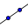
:::{list-table}
:header-rows: 1
* - Orodje
  -
  - Opis
* -  
  - *Premica* (ang. *Line*) 
  - Ustvari premico skozi dve izbrani točki.
* -  
  - *Daljica* (ang. *Segment*) 
  - Ustvari daljico med dvema izbranima točkama.
* - 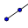 
  - *Poltrak* (ang. *Ray*) 
  - Ustvari poltrak, ki se začne v eni točki in gre skozi drugo točko.
* - 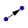 
  - *Vektor* (ang. *Vector*) 
  - Ustvari vektor med dvema izbranima točkama.
:::
::::  

::::{dropdown} 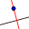
:::{list-table}
:header-rows: 1
* - Orodje
  -
  - Opis
* -  
  - *Pravokotnica* (ang. *Perpendicular line*) 
  - Ustvari pravokotnico glede na izbrano premico skozi določeno točko.
* - 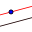 
  - *Paralelna* (ang. *Parallel line*) 
  - Ustvari paralelno premico glede na izbrani objekt skozi določeno točko.
* - 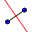 
  - *Simetrala daljice* (ang. *Line bisector*) 
  - Ustvari simetralo daljice med dvema izbranima točkama.
* - 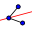 
  - *Simetrala kota* (ang. *Angle bisector*) 
  - Ustvari simetralo kota med tremi izbranimi točkami ali med dve izbranima premicama.
* - 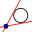 
  - *Tangente* (ang. *Tangent*) 
  - Ustvari tangento na krog ali krivuljo v določeni točki.
:::
::::

::::{dropdown} 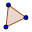
:::{list-table}
:header-rows: 1
* - Orodje
  -
  - Opis  
* -  
  - *Mnogokotnik* (ang. *Polygon*)
  - Ustvari zaprt mnogokotnik z izbranimi oglišči.
* - 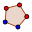 
  - *Pravilen mnogokotnik* (ang. *Regular Polygon*) 
  - Ustvari pravilen mnogokotnik z določenim številom stranic med dvema izbranima točkama.
:::
::::

::::{dropdown} 
:::{list-table} 
:header-rows: 1
* - Orodje
  -
  - Opis
* - 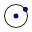 
  - *Krožnica s središčem in točko na njej* (ang. *Circle with Center and Point*) 
  - Ustvari krožnico z določenim središčem in točko na krožnici.
* - 
  - *Krožnica s središčem & polmer* (ang. *Circle with Center and Radius*) 
  - Ustvari krožnico z določenim središčem in polmerom.
* - 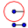
  - *Krožnica z polmerom* (ang. *Circle with Compass*) 
  - Ustvari krožnico z uporabo merila, ki ga nastavite med dvema izbranima točkama.
* - 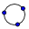 
  - *Krožnica skozi tri točke* (ang. *Circle through Three Points*) 
  - Ustvari krožnico, ki gre skozi tri izbrane točke.
* - 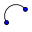 
  - *Polkrog* (ang. *Semicircle*) 
  - Ustvari polkrog z izbrano premerno daljico.
* - 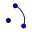 
  - *Krožni lok* (ang. *Arc*) 
  - Ustvari lok krožnice med dvema izbranima točkama z določenim središčem.
* - 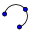 
  - *Obodni lok* (ang. *Circumcircular arc*) 
  - Ustvari obodni krog trikotnika, ki gre skozi tri točke.
* - 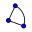
  - *Krožni izsek* (ang. *Circular Sector*)
  - Ustvari krožni izsek z določenim središčem in dvema točkama na krožnici.
* -  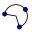
  - *Obodni izek* (ang. *Circumcircular Sector*)
  - Ustvari vpisani krog trikotnika, ki se dotika vseh treh stranic.
:::
::::

::::{dropdown} 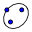 
:::{list-table}  
:header-rows: 1  
* - Orodje  
  - 
  - Opis  
* -   
  - *Elipsa* (ang. *Ellipse*)  
  - Ustvari elipso iz dveh žarišč in točke.  
* - 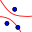  
  - *Hiperbola* (ang. *Hyperbola*)  
  - Ustvari hiperbolo.  
* - 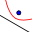  
  - *Parabola* (ang. *Parabola*)  
  - Ustvari parabolo.  
* - 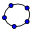  
  - *Konika skozi pet točk* (ang. (*Conic through Five Points*)  
  - Ustvari koniko, ki gre skozi pet izbranih točk.  
:::
::::

::::{dropdown} 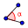 
:::{list-table}  
:header-rows: 1  
* - Orodje 
  - 
  - Opis  
* -   
  - *Kot* (ang. *Angle*)  
  - Ustvari in meri kot med dvema linijama.  
* - 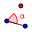  
  - *Kot z dano velikostjo* (ang. *Angle with Given Size*)  
  - Ustvari kot določene mere.  
* - 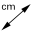  
  - *Razdalja / dolžina* (ang. *Distance or Length*)  
  - Izmeri razdaljo med točkama ali dolžino objekta.  
* - 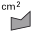  
  - *Ploskev* (ang. (*Area*)  
  - Izmeri površino poligona ali zaprtih oblik.  
* -   
  - *Naklon* (ang. *Slope*)  
  - Izračuna naklon premice.  
* - 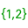  
  - *Seznam* (ang. *List*)  
  - Ustvari seznam objektov.
* - 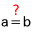  
  - *Relacija* (ang. *Relation*)
  - Ustvari relacijo (enačbo) med objekti.
:::
::::

::::{dropdown} 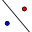  
:::{list-table}  
:header-rows: 1  
* - Orodje  
  - 
  - Opis  
* -   
  - *Zrcali glede na premico* (ang. *Reflect about Line*) 
  - Ustvari sliko objekta zrcaljeno čez premico.  
* - 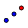  
  - *Zrcali glede na točko* (ang. *Reflect about Point*)
  - Ustvari sliko objekta zrcaljeno čez točko.  
* - 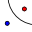  
  - *Zrcali glede na krog* (ang. *Reflect about Circle*)
  - Ustvari inverzijo objekta glede na krog.  
* - 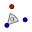  
  - *Rotiraj okoli točke* (ang. *Rotate around Point*)
  - Rotira objekt za dan kot okoli neke točke.  
* - 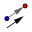  
  - *Translacija po vektorju* (ang. *Translate by Vector*)
  - Premakne objekt po določenem vektorju.  
* - 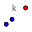  
  - *Dilacija* (ang. *Dilate from Point*)
  - Skalira objekt od izbora točke z določenim faktorjem.  
:::
::::

::::{dropdown}   
:::{list-table}  
:header-rows: 1  
* - Orodje  
  - 
  - Opis  
* -   
  - *Drsnik* (ang. *Slider*)  
  - Ustvari parameter, kjer lahko animirate vrednosti.  
* -   
  - *Besedilo* (ang. *Text*)  
  - Vstavi besedilo v konstrukcijo.  
* -   
  - *Gumb* (ang. *Button*)  
  - Ustvari gumb za izvrševanje ukazov.  
* -   
  - *Slika* (ang. *Image*)  
  - Vstavi sliko iz naprave ali URL-ja.
* -   
  - *Potrditveno polje* (ang. *Check Box*)  
  - Ustvari preklopno polje za vklop / izklop lastnosti.  
* - 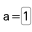  
  - *Vhodno polje* (ang. *Input Box*)  
  - Ustvari polje, kamor lahko ročno vnašate vrednosti.  

:::
::::

::::{dropdown}   
:::{list-table}  
:header-rows: 1  
* - Orodje 
  - 
  - Opis  
* -  
  - *Premakni pogled* (ang. *Move View*)  
  - Premakne pogled grafičnega okna.
* -   
  - *Povečaj* (ang. *Zoom In*)  
  - Približa pogled.    
* -   
  - *Pomanjšaj* (ang. *Zoom Out*)  
  - Oddalji pogled.  
* -   
  - *Prikaži / skrij objekt* (ang. *Show/Hide Object*)  
  - Prikaže ali skrije izbrane objekte.   
* -   
  - *Prikaži / skrij oznako* (ang. *Show/Hide Label*)  
  - Prikaže ali skrije napise/oznake objektov.    
* - 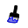  
  - *Kopiraj slog* (ang. *Copy Visual Style*)  
  - Kopira grafične lastnosti iz enega objekta na drugega.   
* -   
  - *Izbriši* (ang. *Delete*)  
  - Izbriše izbran objekt. 
:::
::::

