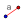

---
kernelspec:
  name: python
  display_name: Python 3
---

(08_geogebraDinGeometrija)=
# Dinamična geometrija z GeoGebro

:::{code-cell} python
:tags: remove-input
import IPython.display as display
from IPython.display import IFrame
:::

V poglavju [](./07_geogebraUvod.md) smo spoznali osnove dela z GeoGebro. V tem poglavju bomo raziskali, kako ustvariti animacije in dinamične konstrukcije z uporabo GeoGebre.

## Točka na objektu

Najlažje način za ustvarjanje dinamične konstrukcije je uporaba točke, ki je vezana na drug objekt. Točko lahko postavimo na premico, krožnico ali katerikoli drug objekt, kar omogoča, da se točka premika znotraj omejitve tega objekta.

:::{exercise}
:label: ex-paralelogram

1. Ustvarite točki $A$ in $B$ in premico $f$ skozi ti dve točki.
2. Ustvarite premico $g$, ki je vzporedna premici $a$. Lahko uporabite pomožno točko $P$, ki jo bomo skriti.
3. Ustvarite točko $C$ na premici $g$. Za to uporabite orodje  *Point on Object* (*Točka na objektu*) oziroma ukaz `Point(g)`.
4. Ustvarite vektor $v=\overrightarrow{AB}$, za to lahko uporabite orodje  *Vector* (*Vektor*) oziroma ukaz `v=Vector(A, B)` ali ukaz `v=A-B`. Opazite razlika med tema dvema ukazoma: prvi ustvari vektor, ki gre iz točke $A$ do točke $B$, drugi pa ustvari vektor z izhodiščem v koordinatnem izhodišču; v tem primeru je to nepomembno, saj bomo vektor uporabili le za premikanje točke.
5. Uporabi orodje  *Translate by Vector* (*Premakni z vektorjem*) oziroma ukaz `D=Translate(C, v)`, da ustvarite točko $D$, ki je slika točke $C$ ob premiku za vektor $v$.
6. Ustvarite štirikotnik $ABDC$ z orodjem  *Polygon* (*Poligon*) oziroma ukaz `Polygon(A, B, D, C)`.
7. Z uporabo *vrstice za zamenjavo sloga* in sicer gumba  *Show/Hide Label* (*Prikaži/skrij oznako*), prikazi površine štirikotnika (izberite možnost *Value* (*Vrednost*)).
8. Poiščite točko $C$ v algebrsko okno, upoštevajte, da ima gumb  *Play*, jo kliknite in opazujte, kako se spreminja površina štirikotnika $ABDC$. Kaj opazite? lahko to dokažite?
:::

```{margin}
[Seznam vaj](#08_geogebraDinGeometrija_vaje)
```

::::{solution} ex-paralelogram
:class: tip dropdown
Spodaj lahko vidite rešitev v GeoGebri. 

:::{code-cell} python
:tags: remove-input
IFrame("https://www.geogebra.org/material/iframe/id/jsje5fbj/width/800/height/571/border/888888/sfsb/true/smb/false/stb/false/stbh/false/ai/false/asb/false/sri/false/rc/false/ld/false/sdz/true/ctl/false", width="570", height=413, allowfullscreen=True)
:::

Lahko tudi jo [odprite v GeoGebri](https://www.geogebra.org/classic/jsje5fbj).
::::

Ko ustvarimo točko na krivulji (kot so premice, krožnice, graf funkcij itd.), lahko to točko animiramo. To naredimo tako, da izberemo točko in kliknemo na gumb  *Play* v algebrskem oknu ali uporabimo ukaz `StartAnimation(<točka>)`. S tem se bo točka začela premikati po objektu, na katerem je bila ustvarjena.

Na žalost GeoGebra ne omogoča animacije točk na daljših objektih, kot so mnogokotniki. Vendar pa lahko ustvarimo drsnike, ki nam omogočajo nadzor nad položajem točke na takšnih objektih s pomočjo parametra.

## Drsniki

V resnični, drsniki so samo orodja za spreminjanje vrednosti spremenljivk. Vendar pa so zelo uporabni pri ustvarjanju dinamičnih konstrukcij, saj nam omogočajo, da spreminjamo vrednosti in opazujemo, kako se konstrukcija spreminja.

Drsniki imajo tri glavne lastnosti: `Min` (minimalna vrednost), `Max` (maksimalna vrednost) in `Increment` (prirastek). Te lastnosti določajo obseg vrednosti, ki jih drsnik lahko zavzame, in kako hitro se vrednost spreminja, ko premikamo drsnik. 

Za ustvarjanje drsnika lahko uporabimo orodje  *Slider* (*Drsnik*) in dobimo okno za nastavitev lastnosti drsnika. Drsnike lahko ustvarimo tudi z vnosom imena spremenljivke v vnosno vrstico, na primer `a=5`, kar ustvari spremenljivk z imenom `a` in začetno vrednostjo $5$. Nato lahko kliknemo na tri pike poleg imena spremenljivke v algebrskem oknu in nato *Create slider* (*Ustvari drsnik*). To ustvari drsnik z privzetimi lastnostmi (`Min=-5`, `Max=5`, `Increment=0.1`), ki jih lahko spremenimo z dvojnim klikom na drsnik (v grafičnem pogledu) ali z desnim klikom na ime spremenljivke v algebrskem oknu in izbiro *Settings* (*Nastavitve*). V oknu z nastavitvami lahko spremenimo lastnosti drsnika, kot so `Min`, `Max` in `Increment`, in tudi druge lastnosti, kot so barva, slog in vidnost.

:::{exercise} 
:label: ex-drsniki-1
1. Ustvarite novo datoteko na GeoGebri v prikaznem načinu *Geometry* (*Geometrija*). Odprite algebrske okno v meniju *View* (*Pogled*) in izberite *Algebra* (*Algebra*).
2. S uporabo *vrstice za zamenajavo sloga* skrijte prikaz osi v grafičnem pogledu.
3. Ustvarite drznika `m` in `b` z uporabo orodja  *Slider* (*Drsnik*) ali z vnosom `m` in `b` v vnosno vrstico. Nastavite drsnika tako, da imata naslednje lastnosti:
   - Drsnik `m`: `Min=-20`, `Max=20`, `Increment=0.5`
   - Drsnik `b`: `Min=-5`, `Max=5`, `Increment=0.1`
4. Ustvarite premico z enačbo `y=m*x+b` v vnosni vrstici.
5. Z orodjem  *Slope* (*Naklon*) oziroma ukazom `Slope(<premica>)` izračunajte naklon premice in ga prikažite v grafičnem pogledu.
6. Ustvarite segment med izhodiščem in točko presečišča premice z osjo $y$ z ukazom ukaz `Segment((0, 0), Intersect(<premica>, yAxis))` 
7. Pobarvate daljico in drsnik $b$ z isti barvi, ter drsnik $m$ in naklon z drugo barvo.
8. Možno je, da naklon ima različen ime (npr $a$) od drsnika $m$. V tem primeru uredite naslov (caption) naklona tako, da se ujema z imenom drsnika $m$. Izberite tudi možnost *Caption in value* (*Naslov in vrednost*) za oznake, da se prikaže vrednost naklona.
9. Ponovite korak 8 za drsnik $b$ in segment.
10. Premikajte drsnika in opazujte, kako se spreminja premica, njen naklon in točka presečišča z osjo $y$.
::: 


```{margin}
[Seznam vaj](#08_geogebraDinGeometrija_vaje)
```

::::{solution} ex-drsniki-1
:class: tip dropdown
Spodaj lahko vidite rešitev v GeoGebri.

:::{code-cell} python
:tags: remove-input
IFrame("https://www.geogebra.org/material/iframe/id/a8bv9bss/width/1140/height/690/border/888888/sfsb/true/smb/false/stb/false/stbh/false/ai/false/asb/false/sri/false/rc/false/ld/false/sdz/true/ctl/false", width="570", height=345, allowfullscreen=True)
:::

Lahko tudi jo [odprite v GeoGebri](https://www.geogebra.org/classic/a8bv9bss).

::::

:::{exercise}
:label: ex-drsniki-2

**Trikotnik neenakosti**

Klasični rezultat v geometriji pravi, da obstaja trikotnik s stranicami dolžin $a$, $b$ in $c$ natanko tedaj, ko so izpolnjene neenakosti:  
\begin{align*}
a + b &> c \\
a + c &> b \\
b + c &> a
\end{align*}

Sgornje neenakosti so znanje kot *trikotne neenakosti*. V tej vaji bomo ustvarili dinamično konstrukcijo, ki bo prikazala, kdaj je mogoče sestaviti trikotnik s pomočjo drsnikov za dolžine stranic.


1. Ustvarite novo datoteko na GeoGebri v prikaznem načinu *Geometry* (*Geometrija*). Odprite algebrske okno v meniju *View* (*Pogled*) in izberite *Algebra* (*Algebra*).
2. Ustvarite tri drsnike `a`, `b` in `c` z uporabo orodja  *Slider* (*Drsnik*) ali z vnosom `a`, `b` in `c` v vnosno vrstico. Nastavite drsnike tako, da imajo naslednje lastnosti:
   - Drsnik `a`: `Min=1`, `Max=10`, `Increment=0.1`
   - Drsnik `b`: `Min=1`, `Max=10`, `Increment=0.1`
   - Drsnik `c`: `Min=1`, `Max=10`, `Increment=0.1`
3. Ustvarite točko $A$, ter ustvarite daljico $AB$ dolžine $c$ z orodjem  *Segment with given length* (*Daljica z določeno dolžino*) oziroma ukazom `Segment(A, c)`.
4. Ustvarite krožnico s središčem v točki $A$ in polmerom $b$ z orodjem  *Circle with Center and Radius* (*Krožnica s središčem in polmerom*) oziroma ukazom `Circle(A, b)`.
5. Ustvarite krožnico s središčem v točki $B$ in polmerom $a$ z orodjem  *Circle with Center and Radius* (*Krožnica s središčem in polmerom*) oziroma ukazom `Circle(B, a)`.
6. Ustvarite točko $C$ kot presečišče obeh krožnic z orodjem  *Intersect* (*Presečišče*) oziroma ukazom `Intersect(<krožnica1>, <krožnica2>)`.
7. Ustvarite trikotnik $ABC$ z orodjem  *Polygon* (*Mnogokotnik*) oziroma ukazom `Polygon(A, B, C)`.
---

Geogebra nam omogoča, da uporabimo dinamične barve. Barvo lahko določimo z uporabo funkcije `If()`, ki deluje tako, da preveri pogoj in vrne eno vrednost, če je pogoj resničen, in drugo vrednost, če je pogoj neresničen. V našem primeru bomo uporabili funkcijo `If()` za določitev barv drsnikov glede na to, ali velja trikotna neenakost.

8. Izberite dve barvi za prikaz veljavnosti trikotne neenakosti, na primer zeleno za veljavno in rdečo za neveljavno. Potrebujete RGB kodo barv, za to, lahko uporabite spletno orodje, kot je [HTML Color Picker](https://www.w3schools.com/colors/colors_picker.asp). V našem primeru bomo uporabili zeleno z RGB kodo `(0, 153, 51)` in rdečo z RGB kodo `(204, 0, 0)`.
9. Nastavite barvo drsnika `a` z uporabo funkcije `If()`, kot sledi:
   - Desni klik na drsnik `a` v algebrskem oknu in izberite *Settings* (*Nastavitve*).
   - Pojdite na zavihek {kbd}`Advanced`.
   - V polje `Red` pod `Dynamic Colours` vnesite naslednji izraz: `If(a<b+c, 0, 204/255)`. Ta izraz določa rdečo komponento barve glede na veljavnost prve trikotne neenakosti `a < b + c` v pogojni funkciji `If()`: $0$ (rdeča komponenta izbrane zelene barve) če velja, $204/255$ (rdeča komponenta izbrane rdeče barve) če ne velja. Vrednost mora biti med $0$ in $1$, zato delimo z $255$.
    - V polje `Green` vnesite naslednji izraz: `If(a< b + c, 153/255, 0)`. 
    - V polje `Blue` vnesite naslednji izraz: `If(a < b + c, 51 / 255, 0)`.
10. Ponovite korak 9 za drsnika `b` in `c`, pri čemer prilagodite pogoj v funkciji `If()` za vsako neenakost:
    - Za drsnik `b`: `If(b < a + c, ...)`
    - Za drsnik `c`: `If(c < a + b, ...)`
11. Premikajte drsnike in opazujte, kako se spreminjajo barve drsnikov. Ko so vse trikotne neenakosti izpolnjene, bodo vsi drsniki zeleni, kar pomeni, da je mogoče sestaviti trikotnik s danimi dolžinami stranic. Če katera od neenakosti ni izpolnjena, bo ustrezni drsnik rdeč, kar pomeni, da trikotnik ni mogoče sestaviti.
 

::: 


```{margin}
[Seznam vaj](_vaje)
```

::::{solution} ex-drsniki-2
:class: tip dropdown

Spodaj lahko vidite rešitev v GeoGebri.

:::{code-cell} python
:tags: remove-input
IFrame("https://www.geogebra.org/material/iframe/id/ajje5wsn/width/1140/height/500/border/888888/sfsb/true/smb/false/stb/false/stbh/false/ai/false/asb/false/sri/false/rc/false/ld/false/sdz/false/ctl/false", width="570", height="250px", allowfullscreen=True)
:::

Lahko tudi jo [odprite v GeoGebri](https://www.geogebra.org/classic/ajje5wsn).

::::

Drsniki lahko tudi uporabimo za ustvarjanje animacij. To naredimo tako, da izberemo drsnik in kliknemo na gumb  *Play* v algebrskem oknu ali uporabimo ukaz `StartAnimation(<drsnik>)`. S tem se bo vrednost drsnika začela spreminjati samodejno z določenim prirastkom, kar omogoča ustvarjanje animacij v konstrukciji.

:::{exercise}
:label: ex-drsniki-3
1. Ustvarite novo datoteko na GeoGebri v prikaznem načinu *Geometry* (*Geometrija*). Odprite algebrske okno v meniju *View* (*Pogled*) in izberite *Algebra* (*Algebra*).
2. Ustvarite drsnik $t$ z ukazom `t=1`, torej kliknite na tri pike poleg imena spremenljivke v algebrskem oknu in nato izberite *Create slider* (*Ustvari drsnik*). Nastavite drsnik tako, da ima naslednjimi lastnostmi: `Min=0`, `Max=1`, `Increment=0.01`.
3. Ustvarite drsnik $\alpha$ z naslednjimi lastnostmi: `Min=0`, `Max=2 pi`, `Increment=0.01`. Lahko uporabite tipkovni bližnjico {kbd}`pi` za vnos vrednosti $\pi$ ali tipkovnico v zaslon.
4. Ustvarite točko $A$ z ukazom `A=Rotate((1,0), α)` , ki vrti točko $(1,0)$ okoli izhodišča za kot $\alpha$. Za vnos kota lahko uporabite tipkovnico iz GeoGebre.
5. Ustvarite točko $B$ z koordinatami $(0,2)$.
6. Ustvarite točko $C$ z ukazom `C=Translate(B, t*(1,1))`.
7. Kliknite na gumb  *Play* v algebrskem oknu poleg drsnika $t$, da začnete animacijo.
8. Ponovite korak 7 za drsnik $\alpha$.
9. Spremenite parametra `Speed` in `Repeat` v oknu z nastavitvami drsnikov, da prilagodite hitrost in način ponavljanja animacije.
:::

```{margin}
[Seznam vaj](_vaje)
```

::::{solution} ex-drsniki-3
:class: tip dropdown

Spodaj lahko vidite rešitev v GeoGebri.

:::{code-cell} python
:tags: remove-input
IFrame("https://www.geogebra.org/material/iframe/id/z9cvwq23/width/1140/height/591/border/888888/sfsb/true/smb/false/stb/false/stbh/false/ai/false/asb/false/sri/false/rc/false/ld/false/sdz/false/ctl/false", width="570", height="295px", allowfullscreen=True)
:::

Lahko tudi jo [odprite v GeoGebri](https://www.geogebra.org/classic/z9cvwq23).
::::

::::{exercise}
:label: ex-drsniki-4
Ustvarite datoteko v GeoGebri, ki prikazuje seštevanje dveh cela števil v intervalu od $-10$ do $10$. 
Uporabite drsnika za vsako število in prikažite rezultat seštevanja v dinamični obliki. 
Navdih lahko poiščite v naslednji GeoGebri konstrukciji:


:::{code-cell} python
:tags: remove-input
IFrame("https://www.geogebra.org/material/iframe/id/jganuymt/width/1140/height/591/border/888888/sfsb/true/smb/false/stb/false/stbh/false/ai/false/asb/false/sri/false/rc/false/ld/false/sdz/true/ctl/false", width="570", height="340px", allowfullscreen=True)
:::


::::

```{margin}
[Seznam vaj](_vaje)
```

:::{solution} ex-drsniki-4
:class: tip dropdown
Konstrukcija, ki je prikazana zgoraj, je ena možna rešitev. 
Lahko jo [odprete v GeoGebri](https://www.geogebra.org/classic/jganuymt).

Koraki za ustvarjanje te konstrukcije so naslednji:
1. Ustvarite drsnika `a` in `b` z lastnostmi: `Min=-10`, `Max=10`, `Increment=1`.
2. Ustvarite točko pomožne točke $O=(0,0)$, $X=(0,1)$ in $Y=(a,2)$ z ukazi `O=(0,0)`, `X=(0,1)` in `Y=(a,2)`.
3. Ustvarite točki $A=(a,1)$ in $B=(a+b,2)$ z ukazi `A=(a,1)` in `B=(a+b,2)`.
4. Ustvarite vektorji `v1=Vector(X,A)` in `v2=Vector(Y,B)`.
5. Ustvarite točko $C$, ki prikaže rezultat seštevanja z ukazom `C=(a+b,0)`.
6. Dodajte oznake in prilagodite slog po želji.
7. Skrijte objekte, ki niso potrebni za prikaz rezultata.
:::

## Zaporedja

Ukaz `Sequence()` omogoča ustvarjanje zaporedij objektov v GeoGebri. Splošna oblika ukaza je `Sequence(<izraz>, <spremenljivka>, <začetek>, <konec>, <korak>)`, kjer `<izraz>` je izraz (običajno ukaz GeoGebre), ki ga želimo ponoviti, `<spremenljivka>` je spremenljivka, ki se spreminja v zaporedju, `<začetek>` in `<konec>` določata obseg vrednosti za spremenljivko, in `<korak>` določa, za koliko se spremenljivka poveča v vsakem koraku.
Variantne ukaza so:
- `Sequence(<konec>)` - ustvari zaporedje števil od 1 do `<konec>`.
- `Sequence(<začetek>,<konec>)` - ustvari zaporedje števil od `<začetek>` do `<konec>`.
- `Sequence(<izraz>, <spremenljivka>, <začetek>, <konec>)` - ustvari zaporedje z privzetim korakom 1.


:::{exercise}
:label: ex_sequences-1

Ustvarite zaporedje točk na krožnici s središčem v izhodišču in polmerom 3, kjer so točke enakomerno razporejene po krožnici. Uporabite ukazi `Sequence()` in `Rotate()` za ustvarjanje točk. Nastavite število točk na 12.
:::

```{margin}
[Seznam vaj](#08_geogebraDinGeometrija_vaje)
```

:::{solution} ex_sequences-1
:class: tip dropdown
1. Ustvarite krožnico s središčem v izhodišču in polmerom 3 z ukazom `c=Circle((0,0), 3)`.
2. Ustvarimo točko $P=(3,0)$.
3. Z uporaba ukazom `Sequence(Rotate(P, i*(2*pi)/12), i, 0, 11)` ustvarimo zaporedje točk, kjer se vsaka točka ustvari z vrtenjem točke $P$ za kot $\frac{2\pi}{12}$ glede na izhodišče. Lahko tudi uporabimo ukaz `Sequence(Rotate(P, i*30°), i, 0, 11)`, kjer je kot izražen v stopinjah.
:::


::::{exercise}
:label: ex_sequences-2
Uporabite ukaz `Sequence()` za ustvarjanje naslednje konstrukcije v GeoGebri. Konstrukcija vsebuje premice, ki povezujejo točke $(10,0)$ z točkama $(0,1)$ in $(0,-1)$; $(9,0)$ z točkama $(0,2)$ in $(0,-2)$; in tako naprej do točke $(1,0)$ z točkama $(0,10)$ in $(0,-10)$ in podoben vzorec na levi strani.

:::{code-cell} python
:tags: remove-input
IFrame("https://www.geogebra.org/material/iframe/id/tbecwvzw/width/1140/height/700/border/888888/sfsb/true/smb/false/stb/false/stbh/false/ai/false/asb/false/sri/false/rc/false/ld/false/sdz/true/ctl/false", width="570", height="340px", allowfullscreen=True)
:::

::::

```{margin}
[Seznam vaj](#08_geogebraDinGeometrija_vaje)
```

:::{solution} ex_sequences-2
:class: tip dropdown
1. Ukaz `Sequence(Segment((10-i,0),(0,i+1)),i,0,9)` ustvari premice na prvim kvadrantu;
2. Podobno, ukaz `Sequence(Segment((10-i,0),(0,-(i+1))),i,0,9)` ustvari premice na četrtem kvadrantu;
3. Ukaz `Sequence(Segment((i-10,0),(0,i+1)),i,0,9)` ustvari premice na drugem kvadrantu;
4. Na koncu, ukaz `Sequence(Segment((i-10,0),(0,-(i+1))),i,0,9)` ustvari premice na tretjem kvadrantu.

Lahko odprite to konstrukcijo v GeoGebri [tukaj](https://www.geogebra.org/classic/tbecwvzw).
:::

Ukaz `Sequence()` ustvari zaporedje objektov, če hočemo izbrati posamezne objekte iz zaporedja, lahko uporabimo ukaz`Element(<zaporedje>, <indeks>)`, kjer `<zaporedje>` je zaporedje objektov in `<indeks>` je indeks objekta, ki ga želimo izbrati (indeksi se začnejo pri 1).

Če hočemo izgraditi več objektov (namesto zaporedje objektov), lahko uporabimo naslednje način:
- Ustvarimo zaporedje objektov z ukazom `Sequence()`, npr. `kroznice = Sequence(Circle((0,0), i), i, 1, 5)`, ki ustvari zaporedje krožnic s polmeri od 1 do 5.
- Nato uporabimo ukazi `Sequence()` in `Element()` za ustvarjanje zaporedja ukazov, npr. `kroU=Sequence("K_{"+i+"} = Element(kroznice, "+i+")", i, 1, 5)`, ki ustvari zaporedje ukazov za vsako krožnico v zaporedju z imenom `krogU`. V tem primeru ustvarimo ukaze `K_{1} = Element(kroznice, 1)`, `K_{2} = Element(kroznice, 2)`, itd.
- Na koncu uporabimo ukaz `Execute()` za izvedbo vsakega ukaza.

:::{exercise}
:label: ex_sequences-3
1. Skrijte štiri zaporedja ki so bila ustvarjena v prejšnji vaji z klikom na krog poleg imena zaporedij v algebrskem oknu.
2. Uporabite način opisano zgoraj za izgraditi 40 daljic, namesto 4 zaporedij. Ugotovite, da imena daljic sledijo vzorcu `L_{1}`, `L_{2}`, ..., `L_{40}`.

:::

```{margin}
[Seznam vaj](_vaje)
```

:::{solution} ex_sequences-3
:class: tip dropdown
1. Predpostavimo, da so bila zaporedja ustvarjena z imeni `zap1`, `zap2`, `zap3` in `zap4`.
2. Najprej uporabimo ukaz `vseDaljice=Join(zap1, zap2, zap3, zap4)` za združitev štirih zaporedij v eno samo zaporedje `vseDaljice`.
3. Nato uporabimo ukaz `daljiceU=Sequence("L_{"+i+"} = Element(vseDaljice, "+i+")", i, 1, 40)` za ustvarjanje zaporedja ukazov za vsako daljico v zaporedju z imenom `daljiceU`.
4. Na koncu uporabimo ukaz `Execute(daljiceU)`.
:::

Ta način lahko uporabimo za ustvarjanje zaporedje ukazov, da ni nujno ustvariti objekte. Na primer z ukazom
`barv=Sequence("SetDynamicColor(L_{"+i+"}, random(), random(), random(), 0.5)", i, 1, 40)`, ustvarimo zaporedje ukazov za nastavitev naključne barve za vsako daljico, nato pa z ukazom `Execute(barv)` izvedemo te ukaze in tako nastavimo barve za vse daljice naenkrat. *Pozkusite to sami*!


---

Zaporedje in drsniki postanejo zelo močna orodja, ko jih kombiniramo skupaj. Na primer, lahko ustvarimo drsnik, ki določa število objektov v zaporedju, in nato uporabimo ta drsnik za ustvarjanje dinamične konstrukcije, ki se spreminja glede na vrednost drsnika. Ta način bomo raziskali v naslednjih vajah.


(08_geogebraDinGeometrija_vaje)=
## Vaje

- [Vaje %s](#ex-paralelogram) - Ustvarite dinamični paralelogram in opazujte, kako se spreminja njegova površina.
- [Vaje %s](#ex-drsniki-1) - Ustvarite premico z drsniki za naklon in presečišče z osjo y ter opazujte, kako se spreminja premica.
- [Vaje %s](#ex-drsniki-2) - Ustvarite dinamično konstrukcijo, ki prikazuje veljavnost trikotne neenakosti s pomočjo drsnikov in dinamičnih barv.
- [Vaje %s](#ex-drsniki-3) - Ustvarite animacijo z uporabo drsnikov za premikanje točk v ravnini.
- [Vaje %s](#ex-drsniki-4) - Ustvarite dinamično konstrukcijo za seštevanje dveh celih števil z uporabo drsnikov.
- [Vaje %s](#ex_sequences-1) - Ustvarite zaporedje točk na krožnici z uporabo ukaza `Sequence()`.
- [Vaje %s](#ex_sequences-2) - Uporabite ukaz `Sequence()` za ustvarjanje vzorca premic v GeoGebri.
- [Vaje %s](#ex_sequences-3) - Uporabite ukazi `Element()` in `Execute()` za ustvarjanje posamezni objektov iz zaporedje.
<!-- - [Vaje %s](#ex_sequences-4) - Ustvarite dinamično konstrukcijo za množenje dveh celih števil z uporabo drsnikov in ukaza `Sequence()`. -->
<!-- - [Vaje %s](#ex_pythagoras) - Ustvarite konstrukcijo, ki prikazuje dokaz Pitagorovega izreka z uporabo drsnikov. -->
<!-- - [Vaje %s](#ex-circleArea) - Ustvarite dinamično konstrukcijo za izračun površine kroga s pomočjo drsnika za polmer kroga. -->

::::{exercise} Domača naloga 
:label: ex_sequences-4
Ustvarite dinamično konstrukcijo, ki uporabi drsnika za določanje vrednosti dveh celih števil v intervalu od $1$ do $10$ in z uporabo ukaza `Sequence()` ustvari zaporedje točk v ravnini, da bi prikazala množenje teh dveh števil kot pravokotnik s točkami. 
Navdih lahko poiščete v naslednji GeoGebri konstrukciji:

:::{code-cell} python
:tags: remove-input
IFrame("https://www.geogebra.org/material/iframe/id/nkczhbrd/width/800/height/800/border/888888/sfsb/true/smb/false/stb/false/stbh/false/ai/false/asb/false/sri/false/rc/false/ld/false/sdz/true/ctl/false", width="570", height="570", allowfullscreen=True)
:::

::::


<!-- ```{margin}
[Seznam vaj](#08_geogebraDinGeometrija_vaje)
``` -->

<!-- :::{solution} ex_sequences-4
:class: tip dropdown
Lahko uporabite naslednje korake za ustvarjanje te konstrukcije:
1. Ustvarite drsnika `a` in `b` z lastnostmi: `Min=1`, `Max=10`, `Increment=1`.
2. Upoštevajte da ukaz `Sequence((i,j),i,1,a)` ustvari zaporedje točk v dani vrstici z drugim koordinato `j`. 
3. Uporabite ukaz `točke=Sequence(Sequence((i,j),i,1,a),j,1,b)` za ustvarjanje zaporedja točk v pravokotniku z dolžino `a` in širino `b`.
5. Z uporabo ukaza `FormulaText("$"+a+"\times"+b+"="+(a*b)+"$")` ustvarite dinamično besedilo, ki prikazuje rezultat množenja `a` in `b`.
6. Uredite položaj besedila in slog po želji.

Lahko odprete to konstrukcijo v GeoGebri [tukaj](https://www.geogebra.org/classic/nkczhbrd).

::: -->


::::{exercise}
:label: ex-gauss
Oglejte si naslednjo GeoGebro konstrukcijo, kateri znani rezultat predstavlja?
Ponovno ustvarite to konstrukcijo in dodajte potrebne elemente, da bo čim bolj razumljiva, glede na izračun, ki ga prikazuje.

:::{code-cell} python
:tags: remove-input
IFrame("https://www.geogebra.org/material/iframe/id/f3he3pxy/width/700/height/724/border/888888/sfsb/true/smb/false/stb/false/stbh/false/ai/false/asb/false/sri/true/rc/false/ld/false/sdz/true/ctl/false", width="570", height="559", allowfullscreen=True)
:::


::::


::::{exercise} Domača naloga
:label: ex-circleArea
Ustvarite dinamično konstrukcijo, ki prikazuje izračun površine kroga s pomočjo drsnika za polmer kroga. 
Navdih lahko poiščete v naslednji GeoGebri konstrukciji:


:::{code-cell} python
:tags: remove-input
IFrame("https://www.geogebra.org/material/iframe/id/rzqs7ets/width/1512/height/884/border/888888/sfsb/true/smb/false/stb/false/stbh/false/ai/false/asb/false/sri/false/rc/false/ld/false/sdz/false/ctl/false", width="570", height="340px", allowfullscreen=True)
:::

Pomoč pri konstrukciji lahko najdete spodaj.


::::

:::{solution} ex-circleArea
:class: tip dropdown
Koraki za ustvarjanje te konstrukcije so naslednji:
1. Ustvarite drsnik `n` z lastnostmi: `Min=1`, `Max=100`, `Increment=1`. Drsnik `n` bo določal število sektorjev kroga ($2n$). 
2. Ustvarite krožni izsek s središčem v izhodišču in polmerom $1$, zato sledite naslednjim korakom:
   - Ustvarite točko $A=(1,0)$.
   - Ustvarite točko $B$ z ukazom `B=Rotate(A, <kot>)` (morate izračunati kot glede na število sektorjev $2n$).
   - Ustvarite krožni izsek z ukazom z orodja  *Circular sector* (*Krožni izsek*) oziroma ukazom `CircularSector((0,0), A, B)`.
3. Ustvarite zaporedje $2n$ krožnih izsekov, zato, uporabite ukaza `Sequence` in `Rotate`.
4. Z uporabo ukaza `Translate` premaknite izseke, da ustvarite približek pravokotnika. Potrebno je, da točno izračunate premik glede na kot in število sektorjev.
:::


::::{exercise} Domača naloga
:label: ex_pythagoras

Ustvarite konstrukcijo v GeoGebri, ki prikazuje dokaz Pitagorovega izreka z uporabo drsnikov.
Navdih lahko poiščete v naslednji GeoGebri konstrukciji:

:::{code-cell} python
:tags: remove-input
IFrame("https://www.geogebra.org/material/iframe/id/hcpn8ym4/width/1140/height/884/border/888888/sfsb/true/smb/false/stb/false/stbh/false/ai/false/asb/false/sri/true/rc/true/ld/false/sdz/false/ctl/false", width="570", height="442", allowfullscreen=True)
:::

Pomoč pri konstrukciji lahko najdete spodaj.
::::


:::{solution} ex_pythagoras
:class: tip dropdown
Koraki za ustvarjanje te konstrukcije so naslednji:
1. Ustvarite točki $A$ in $B$.
2. Ustvarite polkrožnico s premerom $AB$.
3. Ustvarite točko $C$ na polkrožnici, tako ugotovimo da je trikotnik $ABC$ pravokoten pri točki $C$ (zakaj?). Če želite, lahko prikažete tudi pravokotni kot z orodjem  *Angle* (*Kot*).
4. Ustvarite use tri kvadrat na na stranicah trikotnika.
5. Ustvarite naslednje premice:
    - Premica preko $C$ pravokotna na $AB$.
    - Premica vzporedna s $AC$ skozi nasprotno oglišče kvadrata na $AB$.
    - Premica vzporedna s $BC$ skozi nasprotno oglišče kvadrata na $AB$.
6. Ustvarite eno kopijo kvadrata na $AC$ in eno kopijo kvadrata na $BC$.
7. Animirajte te kopiji tako, da se preoblikujeta v paralelogrami do presičišča z ustreznimi premicami (kot prva animacija v konstrukciji).
8. Ustvarite paralelogrami na stranicah $AC$ in $BC$ da prestavita zadnja položaja kopij kvadratov.
9. Animirajte tako da strani, ki imata na premici skozi $C$. Premikajte točke, dokler ena stran paralelograma ni na premici skozi $C$ (kot druga animacija v konstrukciji).
10. Ustvarite kvadrat, ki ga dobimo, ko združimo paralelograma, in ga animirajte, dokler ne doseže kvadrata nad strani $AB$.

:::


