---
kernelspec:
  name: python
  display_name: Python 3
---

(09_geogebraAnaliza)=
# Analiza z GeoGebro

:::{code-cell} python
:tags: remove-input
import IPython.display as display
from IPython.display import IFrame
:::

## Sledovi (traces in loci)

Sledovi (ang. *traces*) in loci (ang. *loci*) so uporabna orodja v GeoGebri za analizo geometrijskih in funkcijskih lastnosti. Sledovi omogočajo sledenje poti točke, ki se premika glede na druge objekte, medtem ko loci prikazujejo množico točk, ki izpolnjujejo določene pogoje.
Razlika med sledovi in loci je v tem, da sledovi prikazujejo pot posamezne točke, medtem ko loci prikazujejo celotno množico točk, ki izpolnjujejo določene pogoje. Najlaže je, da to ponazorimo z naslednjo konstrukcijo:


::::{exercise}
:label: ex-peaucellier
Ustvarite Peaucellier-Lipkinov mehanizem v GeoGebri:

:::{figure}./geogebra/images/Linkage.svg 
:label: fig-peaucellier
:align: center
Peaucellier-Lipkinov mehanizem
:::

1. Ustvarite tri drsnike `r_{1}`, `r_{2}` in `r_{3}`, vse tri z lastnostmi `Min=0`, `Max=10` in `Increment=0.1`.
1. Ustvarite točke $A$, $B$ in $C$ tako da bo dolžina $AB = AC = r_{1}$. Kako to zagotovite?
1. Spremenite slog točk $A$ in $B$, da bodo videti drugače kot ostale točke, npr. z obliko .
1. Ustvarite točki $D$ in $F$ tako, da veljata $BD = BE = r_{2}$ in $CD = CE = r_{3}$. Kako to zagotovite?
1. Ustvarite točko $F$ tako, da velja $DF=FE=CD=CE = r_3$. Kako to zagotovite?
1. Skrijte vse objekte, razen točk.
1. Ustvarite daljice med točkami, tako da dobite mehanizem kot na [Sliki %s](#fig-peaucellier). Dodajte barve in prilagodite debelino črt po želji, mogoče taki, da imajo daljice iste dolžine enako barvo.
1. Kliknite z desnim klikom na točko $F$ in izberite možnost *Trace On* (*Sledi vklopljeno*).
1. Premikajte točko $C$ tako da je vedno $C$ na krožnici s središčem v $A$ in polmerom $r_{1}$. Opazujte sled točke $F$. Kaj opazite o sledi točke $F$? Kakšna je njena oblika? Kako to lahko dokažete?

--- 

Sledi se izbrišejo, ko pogled osvežimo (npr. z Zoom In/Out or Move View). Če želimo sled ohraniti, lahko uporabimo ukaz `Locus`. Na primer, ukaz `Locus(F, C)` ustvari locus točke $F$ glede na premikajočo se točko $C$. Locus ostane v grafičnem oknu tudi po osvežitvi pogleda.
::::

```{margin}
[Seznam vaj](#vaje_geogebraAnaliza)
```

::::{solution} ex-peaucellier
:class: tip dropdown

1. Ustvarite drsnik $r_{1}$ z orodjem 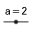 *Slider* (*Drsnik*) oziroma z vnosom `r_{1}` v vhodno vrstico in pritiskom na {kbd}`↵`. V pojavnem oknu nastavite lastnosti drsnika. Ponovite za drsnika $r_{2}$ in $r_{3}$.
2. Ustvarite točko $A$ z orodjem 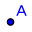 *Point* (*Točka*) oziroma z vnosom `A=(0,0)` (recimo) v vhodno vrstico.
3. Ustvarite točko $B$, zato najprej ustvarite krožnico s središčem v $A$ in polmerom `r_{1}` z orodjem 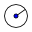 *Circle with Center and Radius* (*Krožnica s središčem in polmerom*) oziroma z vnosom `c_1=Circle(A, r_{1})`. Nato ustvarite točko $B$ na krožnici z orodjem 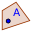 *Point on Object* (*Točka na objektu*) oziroma z vnosom `B=Point(c_1)`. Podobno ustvarite točko $C$ na krožnici $c_{1}$. Premikajte točko $B$ in $C$ po krožnici, če je potrebno. 
5. Ustvarite krožnico s središčem v $B$ in polmerom `r_{2}` z orodjem  *Circle with Center and Radius* (*Krožnica s središčem in polmerom*) oziroma z vnosom `c_2=Circle(B, r_{2})`. Nato ustvarite krožnico s središčem v $C$ in polmerom `r_{3}` z orodjem  *Circle with Center and Radius* (*Krožnica s središčem in polmerom*) oziroma z vnosom `c_3=Circle(C, r_{3})`.
6. Ustvarite točki $D$ in $E$ kot presečišči krožnic $c_{2}$ in $c_{3}$ z orodjem 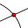 *Intersect* (*Presečišče*) oziroma z vnosom `Intersect(c_2, c_3)` (dobili boste dve točki). Možno boste morali premakniti drsnike, da se krožnici sekata.
7. Ustvarite krožnico s središčem v $D$ in polmerom `r_{3}` in nato krožnico s središčem v $E$ in polmerom `r_{3}`. Nato ustvarite točko $F$ kot presečišče teh dveh krožnic z orodjem  *Intersect* (*Presečišče*) oziroma z vnosom `Intersect(Circle(D, r_{3}), Circle(E, r_{3}))`. Opazite da je točka $G=C$ druga točka presečišča krožnic. 
8. Skrijte vse objekte, razen točk, z desnim klikom na objekte in izbiro možnosti *Show Object* (*Prikaži objekt*) oziroma z klikom na krog poleg objekta v algebrskem oknu.
9. Ustvarite daljice med točkami z orodjem 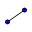 *Segment* (*Daljica*) oziroma z uporaba ukazom `Segment(<točka>, <točka>)`. Dodajte barve in prilagodite debelino črt po želji, mogoče taki, da imajo daljice iste dolžine enako barvo.
10. Kliknite z desnim klikom na točko $F$ in izberite možnost *Trace On* (*Sledi vklopljeno*).
11. Premikajte točko $C$ z miško ali z gumbom  *Play* (*Predvajaj*). Opazujte sled točke $F$. 
12. Izberite možnost *Teace on* za točko $G$ in premikajte točko $C$ ponovno. Opazujte sled točke $G$.
13. Če hočete ohraniti sled, uporabite ukaz `Locus(F, C)` in `Locus(G, C)` v vhodno vrstico.

Lahko vidite rešitev tukaj:

:::{code-cell} python
:tags: remove-input
IFrame("https://www.geogebra.org/material/iframe/id/dsmqzmw9/width/1115/height/814/border/888888/sfsb/true/smb/false/stb/false/stbh/false/ai/false/asb/false/sri/true/rc/false/ld/false/sdz/false/ctl/false", width="570", height="410px", allowfullscreen=True)
:::

ali pa v GeoGebri [tukaj](https://www.geogebra.org/classic/dsmqzmw9).
::::

:::{seealso} Glej tudi
Peucellier-Lipkinov mehanizem je opisan tudi na [Wikipediji](https://en.wikipedia.org/wiki/Peaucellier%E2%80%93Lipkin_linkage) (ang.). To je mehanizem, ki pretvarja krožno gibanje v ravno linijsko gibanje. Uporablja se lahko za risanje ravnih črt brez uporabe ravnila, poleg tega, lahko tudi uporabimo za risanje krožnic brez uporabe kompasa.
:::

:::{exercise}
:label: ex-cat
Predstavljajte si 5-metrsko lestev, ki leži na steni (os y) in tleh (os x). Če se lestev zdrsne po tleh, kakšna je pot mačke (če se ta ne premakne)? Uporabite GeoGebro za modeliranje tega problema in risanje poti mačke.
:::

```{margin}
[Seznam vaj](#vaje_geogebraAnaliza)
```

::::{solution} ex-cat
:class: tip dropdown
Lahko uporabimo naslednje korake:
1. Ustvarite točko $A$ na osi $x$ z orodjem  *Point in Object* (*Točka v objektu*) oziroma z vnosom `A=(a,0)`, kjer je `a` spremenljivka da lahko premikamo s drsnikom.
2. Ustvarite točko $B$ kot presečišče krožnice s središčem v $A$ in polmerom 5 ter osi y z orodjem  *Intersect* (*Presečišče*) oziroma z vnosom `B=Intersect(Circle(A, 5), yAxis)`.
3. Ustvarite daljico $AB$ in točko $C$ na daljici $AB$ z orodjem  *Point in Object* (*Točka v objektu*).
4. Vklopite sled točke $C$ z desnim klikom na točko in izbiro možnosti *Trace On* (*Sledi vklopljeno*).
5. Premikajte točko $A$ vzdolž osi $x$ in opazujte sled točke $C$.


Lahko vidite rešitev tukaj:

:::{code-cell} python
:tags: remove-input
IFrame("https://www.geogebra.org/material/iframe/id/f2a2afp9/width/1512/height/916/border/888888/sfsb/true/smb/false/stb/false/stbh/false/ai/false/asb/false/sri/true/rc/false/ld/false/sdz/false/ctl/false", width="581", height="352px", allowfullscreen=True)
:::

ali pa v GeoGebri [tukaj](https://www.geogebra.org/classic/f2a2afp9).

::::

Lahko tudi uporabimo orodja  *Image* (*Slika*) za uvoz slike mačke in nato sledimo poti določene točke na sliki. To je prikazano v naslednjem konstrukciji:

:::{code-cell} python
:tags: remove-input
IFrame("https://www.geogebra.org/material/iframe/id/hmycsecx/width/1140/height/700/border/888888/sfsb/true/smb/false/stb/false/stbh/false/ai/false/asb/false/sri/true/rc/true/ld/false/sdz/true/ctl/false", width="570", height="350px", allowfullscreen=True)
:::

Če želite, lahko to konstrukcijo odprete v GeoGebri [tukaj](https://www.geogebra.org/classic/hmycsecx). **Poskusite sami!**, Če želite, lahko uporabite moje slike: [](./geogebra/images/wall.png) in [](./geogebra/images/cat.png).


## Funkcije

GeoGebra ima veliko vnaprerej določenih funkcij, ki jih lahko uporabimo za analizo. Nekatere izmed teh funkcij vključujejo: `sin()` (sinus), `cos()` (kosinus), `tan()` (tangens), `exp()` (eksponentna funkcija), `ln()` (naravni logaritem) in še več. (celoten seznam (v ang.) [tukaj](https://geogebra.github.io/docs/manual/en/Predefined_Functions_and_Operators/)) Te funkcije lahko uporabimo za ustvarjanje grafov in izvajanje različnih analiz.

Za uporaba funkcije v GeoGebri, preprosto vnesite ime funkcije, sledeno z oklepaji, ki vsebujejo argumente funkcije. Na primer, za risanje grafa funkcije $f(x) = \sin(x)$, vnesite `f(x) = sin(x)` v vhodno vrstico in pritisnite {kbd}`↵`.

Lahko tudi ustvarimo funkcije, ki so odvisne od drugih objektov v GeoGebri. Na primer, z ukazom `g(x) = ax^3 + bx^2 + cx + d` lahko ustvarimo funkcijo, ki je odvisna od spremenljivk `a`, `b`,`c` in `d`. Te spremenljivke lahko nato nastavimo na določene vrednosti ali jih povežemo z drsniki za dinamično prilagajanje funkcije.

Nekatera pomembna orodja za delo s funkcijami so:

- Ukaz `Roots(<funkcija>, <min x>, <max x> )` najde ničle funkcije na intervalu $[\min x, \max x]$.
- Ukaz `Max(<funkcija>, <min x>, <max x>)` najde maksimum funkcije na določenem intervalu.
- Ukaz `Min(<funkcija>,<min x>, <max x>)` najde minimum funkcije na intervalu $[\min x, \max x]$.


Če hitro želimo najti nekatere lastnosti funkcije, lahko uporabimo orodje 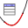 *Function Inspector* (*Lastnosti funkcije*). To orodje nam omogoča hitro analizo funkcije in izračun njenih lastnosti, kot so ničle, ekstremi, infleksijske točke in še več.

::::{exercise}
:label: ex-functions-1
1. Ustvarite funkcijo $f(x) = x^3 - 3 x^2 - x + 3$ v GeoGebri.
2. Uporabite orodje  *Function Inspector* (*Lastnosti funkcije*) za analizo funkcije in določitev njenih ničel, maksimumov in minimumov.
3. Uporabite ukaz `Roots(f, -5, 5)` za iskanje ničel funkcije na intervalu $[-10, 10]$.
4. Uporabite ukaz `Max(f, -5, 5)` in `Min(f, -5, 5)` za iskanje maksimumov in minimumov funkcije na intervalu $[-5, 5]$.
5. Prikaz rezultate vaših analiz v grafičnem oknu. Zato, imate dva načina:
    - Uporabite orodje 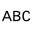 *Text* (*Besedilo*) za ustvarjanje besedilnih oznak na grafu, ki prikazujejo vrednosti. Uporabite prikaz {kbd}`> Advanced` tako da lahko uporabite LaTeX in objekte GeoGebre v besedilu.
    - Uporabite ukaz `FormulaText(<objekt>)` za ustvarjanje besedilnih oznak, ki prikazujejo formule in vrednosti objektov GeoGebre, npr. ukaz `"f(x) = " + FormulaText(f)` ustvari besedilo $f(x)= x^3 - 3 x^2 - x + 3$.
::::

```{margin}
[Seznam vaj](#vaje_geogebraAnaliza)
```

::::{solution} ex-functions-1
:class: tip dropdown
1. Vnesite `f(x) = x^3 - 3 x^2 - x + 3` v vhodno vrstico in pritisnite {kbd}`↵`.
2. Izberite orodje  *Function Inspector* (*Lastnosti funkcije*) in kliknite na graf funkcije $f$. Orodje bo prikazalo lastnosti funkcije, vključno z ničlami, maksimumi in minimumi.
3. Vnesite `Roots(f, -5, 5)` v vhodno vrstico in pritisnite {kbd}`↵`. GeoGebra bo izračunala ničle funkcije na določenem intervalu.
4. Vnesite `Max(f, -5, 5)` in `Min(f, -5, 5)` v vhodno vrstico in pritisnite {kbd}`↵`. GeoGebra bo izračunala maksimum in minimum funkcije na določenem intervalu.
5. Za prikaz rezultatov v grafičnem oknu vnesemo (napišite v vhodno vrstico, ne kopirajte in prilepite):
   - `"f(x) = " + FormulaText(f)` za prikaz formule funkcije.
   - `"$\operatorname{Ničle}="+(FormulaText({Roots(f,-5,5)}))+"$"` za prikaz ničel funkcije.
   - `"$\max f= " + FormulaText(Max(f, -5, 5))+$` za prikaz maksimuma funkcije.
   - `"$\min f: " + FormulaText(Min(f, -5, 5))+$` za prikaz minimuma funkcije.
6. Uredite besedilo, da izgleda kot LaTeX in da imajo določena položaj v grafičnem oknu.

Lahko vidite rešitev tukaj:

:::{code-cell} python
:tags: remove-input
IFrame("https://www.geogebra.org/material/iframe/id/aveg7tkr/width/1150/height/840/border/888888/sfsb/true/smb/false/stb/false/stbh/false/ai/false/asb/false/sri/true/rc/true/ld/false/sdz/true/ctl/false", width="570", height="420", allowfullscreen=True)
:::

ali pa v GeoGebri [tukaj](https://www.geogebra.org/classic/aveg7tkr).

::::

Ko delamo s funkcijami v LaTeXu, je lahko koristno, da uredimo funkcije, s katerimi delamo. Za to, lahko uporabimo orodja 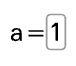 *Input box* (*Vhodno polje*). Ko ustvarimo vhodno polje, dobimo okno kjer določamo objekt, ki ga želimo prikazati in urejati *Linked Object* (*Povezani objekt*) in *Caption* (*Naslov*), ki bo prikazan poleg vhodnega polja.


## Odvodi in integrali

:::{exercise}
:label: ex-odvod-def
Ustvarite konstrukcijo v GeoGebri, ki omogoča prikaz definicije odvoda funkcije.

1. Ustvarite funkcijo $f(x)=x$ v GeoGebri.
1. Ustvarite vhodno polje, ki je povezano s funkcijo $f$ in naslov "$f(x) = $".
1. Ustvarite drsnik $h$ z lastnostmi `Min=-1`, `Max=1` in `Increment=0.01`.
1. Ustvarite vhodno polje, ki je povezano z drsnikom $h$ in naslov "$\Delta x = $".
1. Ustvarite drsnik $a$ z lastnostmi `Min=-10`, `Max=10` in `Increment=0.01`.
1. Ustvarite vhodno polje, ki je povezano z drsnikom $a$ in naslov "$a = $".
1. Ustvarite vhodno polje, ki je povezano z novo spremenljivko `inc` in naslov $\Delta x \text{ povečanje}$.
1. Definirajte increment drsnika h kot `inc`.
1. Ustvarite naslednje točke: 
    - Točka s koordinatama $(a, 0)$.
    - Točka s koordinatama $(a, f(a))$.
    - Točka s koordinatama $(a+h, 0)$.
    - Točka s koordinatama $(a+h, f(a+h))$.
1. Z uporabo prejšnjih točk ustvarite tangento na grafu funkcije $f$ v točki $(a, f(a))$ in sekantno med točkama $(a, f(a))$ in $(a+h, f(a+h))$.
1. Ustvarite nakloni tangente in sekantne. 
1. Ustvarite kontrolni okvirčki za prikaz tangente in sekantne in njegovih naklonov.
1. Ustvarite besedilo da prikazuje definicijo odvoda funkcije $f$ v točki $a$ kot limitni izraz. Ustvarite tudi kontrolni okvirček za prikaz besedila.
:::

```{margin}
[Seznam vaj](#vaje_geogebraAnaliza)
```

::::{solution} ex-odvod-def
:class: tip dropdown
Rešitve lahko vidite tukaj:

:::{code-cell} python
:tags: remove-input
IFrame("https://www.geogebra.org/material/iframe/id/xjbmjrbm/width/1150/height/884/border/888888/sfsb/true/smb/false/stb/false/stbh/false/ai/false/asb/false/sri/true/rc/true/ld/true/sdz/true/ctl/false", width="570", height="442", allowfullscreen=True)
:::

Ali v GeoGebri [tukaj](https://www.geogebra.org/classic/xjbmjrbm).
::::


:::{exercise}
:label: ex-odvod
V konstrukciji iz prejšnje vaje, dodajte možnost za prikaz grafa odvoda funkcije $f$. 

1. Ustvarite točko $Y$ z koordinatama $(a, m)$, kjer je $m$ naklon tangente.
1. Aktivirajte možnost *Trace On* (*Sledi vklopljeno*) za točko $Y$.
1. Ustvarite novo funkcijo $f'(x)$ kot odvod funkcije $f(x)$ z ukazom `Derivative(f)` oziroma z ukazom `f'(x)`.
1. Ustvarite kontrolni okvirček za prikaz grafa funkcije $f'$.
1. Upoštevajte, da je sled točke $Y$ nad grafom funkcije $f'$.
:::


:::{exercise}
:label: ex-integral

Ustvarite konstrukcijo v GeoGebri, ki omogoča prikaz določenega integrala funkcije $f$ med točkama $a$ in $b$.

1. Ustvarite funkcijo $f(x)=2-x^2$ ter ustvarite vhotno polje, ki je povezano s funkcijo $f$ in naslov "$f(x) = $".
1. Ustvarite točki $A$ in $B$ z koordinatama $(0, 0)$ in $(1, 0)$ in ustvarite številki $a$ in $b$ kot $x$-koordinati točk $A$ in $B$ z uporaba ukazov `a=x(A)` in `b=x(B)`.
1. Ustvarite drsnik $n$ z lastnostmi `Min=1`, `Max=100` in `Increment=1` za določanje števila pravokotnikov.
1. Ustvarite različni približki določenega integrala z uporabo pravokotnikov:
    - Zgornja vsota z ukazom `UpperSum(f, a, b, n)`.
    - Spodnja vsota z ukazom `LowerSum(f, a, b, n)`.
    - Trapezna vsota z ukazom `TrapeziumSum(f, a, b, n)`.
1. Izračunajte tudi *Riemanova vsota*:
   - Ustvarite drsnik $p$ z lastnostmi `Min=0`, `Max=1` in `Increment=0.01` za določanje naključne točke v vsakem podintervali.
   - Ustvarite ukaz `RectangleSum(f, a, b, n, p)` za izračun Riemanove vsote. 
   - Raziščite, kaj se zgodi, ko spremenimo vrednost drsnika $p$ (uporabite $n \geq 3$).
1. Izračunajte določen integral z ukazom `Integral(f, a, b)`.
1. Ustvarite kontrolne okvirčke za prikaz vseh vsot in določenega integrala.
:::

```{margin}
[Seznam vaj](_vaje)
```

::::{solution} ex-integral
:class: tip dropdown
Eno možno rešitev lahko vidite tukaj:

:::{code-cell} python
:tags: remove-input
IFrame("https://www.geogebra.org/material/iframe/id/ubp6wt43/width/1150/height/788/border/888888/sfsb/true/smb/false/stb/false/stbh/false/ai/false/asb/false/sri/true/rc/true/ld/false/sdz/true/ctl/false", width="575", height="369", allowfullscreen=True)
:::

ali pa v GeoGebri [tukaj](https://www.geogebra.org/classic/ubp6wt43).

::::

## Polarni krivulje

GeoGebra omogoča tudi risanje in analizo polarnih krivulj. Polarne krivulje so definirane z enačbami v polarnih koordinatah, kjer je vsaka točka določena z razdaljo od izhodišča (polmer) in kotom glede na pozitivno smer osi $x$.

Poleg tega, lahko prikažemo polarno omrežje v grafičnem oknu z klikom na 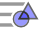 *Vrstica za zamenjavo sloga*, nato na 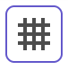 *Show grid* (*Omrežje*) in izberemo možnost 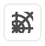*Polar Grid* (*Polarno omrežje*).

::::{exercise}
:label: ex-polarni
1. V pogledu algebre vstavite točko $A=(3; \pi/2)$ (po potrebi uporabite pomožno tipkovnico). Bodite pozorni na podpičje.
2. Ustvarite drsnik z imenom $a$ z lastnostmi `Min=0`, `Max=1` in `Increment=0.01`.
3. V vnosno vrstico vstavite `r=1+cos(θ)` (po potrebi uporabite pomožno tipkovnico). To ustvari krivuljo, ki lahko tudi definirano z ukazom `Curve((1+cos(θ); θ),θ,0,2*π)`
4. Ustvarite točko `B=(A+(1+cos(2*π*a);2*π*a)`.
5. Skrijte krivula in vklopite sled točke $B$ z desnim klikom na točko in izbiro možnosti *Trace On* (*Sledi vklopljeno*). Alternativno, uporabite ukaz `Locus(B,a)`.
6. Animirajte drsnik $a$ in opazujte sled točke $B$.

---

7. Izberite še dve polarne krivulje iz spodnjega datoteka GeoGebra in ponovite zgornje korake. Pazite da uporabite nove točke in da začetni položaj točke $A$ ni nujno enak kot prej.


:::{code-cell} python
:tags: remove-input
IFrame("https://www.geogebra.org/material/iframe/id/s9gtp7rn/width/1250/height/740/border/888888/sfsb/true/smb/false/stb/false/stbh/false/ai/false/asb/false/sri/false/rc/false/ld/false/sdz/false/ctl/false", width="570", height="340px", allowfullscreen=True)
:::

::::


<!-- ```{margin}
[Seznam vaj](#vaje_geogebraAnaliza)
```

:::{solution} ex-polarni
:class: tip dropdown
::: -->


(vaje_geogebraAnaliza)=
## Vaje

- [Vaja %s](#ex-peaucellier) Ustvarite Peaucellier-Lipkinov mehanizem v GeoGebri in analizirajte sled točke $F$.
- [Vaja %s](#ex-cat) Kako se premika mačka, ko se lestev zdrsne po tleh?
- [Vaja %s](#ex-functions-1) Ustvarite funkcijo in analizirajte njene lastnosti z orodji GeoGebre. 
- [Vaja %s](#ex-odvod-def) Ustvarite konstrukcijo v GeoGebri, ki omogoča prikaz definicije odvoda funkcije.
- [Vaja %s](#ex-odvod) V konstrukciji iz prejšnje vaje, dodajte možnost za prikaz grafa odvoda funkcije.
- [Vaja %s](#ex-integral) Ustvarite konstrukcijo v GeoGebri, ki omogoča prikaz določenega integrala funkcije med točkama $a$ in $b$.
- [Vaja %s](#ex-polarni) Ustvarite polarne krivulje in analizirajte njihove lastnosti z orodji GeoGebre.