---
kernelspec:
  name: python
  display_name: Python 3
---

(10_geogerbra3D)=
# Tridimenzionalna geometrija z GeoGebro

:::{code-cell} python
:tags: remove-input
import IPython.display as display
from IPython.display import IFrame
:::

GeoGebra 3D omogoča delo s tridimenzionalnimi objekti in njihovo vizualizacijo. V tem poglavju bomo raziskali osnovne funkcije GeoGebre 3D ter kako jih uporabiti za ustvarjanje in analizo tridimenzionalnih geometrijskih oblik.

Za delo v GeoGebri 3D moramo najprej preklopiti na 3D pogled. To storimo tako, da iz menija izberemo "Perspectives" in nato "3D Graphics". Prikaz "3D Graphics" vključuje tridimenzionalno koordinatno mrežo, ki nam omogoča ustvarjanje in manipulacijo 3D objektov, in tudi algebrsko okno, kjer lahko vidimo seznam vseh ustvarjenih objektov in njihovih lastnosti, podoben kot v 2D pogledu.

Točke v 3D prostoru ustvarimo z orodjem  *Point* (*Točka*). Kliknemo na orodje in nato v 3D prostoru izberemo lokacijo, kjer želimo postaviti točko. Za to, moramo najprej določiti koordinate $x$ in $y$ v ravnini (sivi ravnini na 3D prikazu), nato pa določimo višino $z$ tako, da povlečemo točko navzgor ali navzdol. Ko ustvarimo točko, se njene koordinate prikažejo v algebrskem oknu. Alternativno lahko točko ustvarimo tudi z vnosom njenih koordinat v algebrsko okno, na primer `A = (2, 3, 4)`.

Podobno, za premikanje točk v 3D prostoru uporabimo orodje  *Move* (*Premakni*). Nato lahko preklapljate med dvema načinoma s ponavljajočim klikom na točko, medtem ko je orodje aktivno: premikanje po ravnini (vzporedno v sivo ravnino) in premikanje navpično (v smeri osi $z$).

Najlažje način za učenje orodje je, da jih raziskujete.

## Točke in krogle

:::{exercise} [Seznam vaj ⤵️ ](#10_geogebra3D_vaje)
:label: ex-spheres
1. Ustvarite točki $A = (0,0,0)$ in $B = (2,3,2)$. To lahko naredite z orodjem  *Point* (*Točka*) ali z vnosom koordinat v algebrsko okno.
2. Uporabite orodje 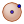 *Sphere: Centre & Point* (*Sfera: središče & točka *) za ustvarjanje krogle s središčem v točki $A$ in skozi točko $B$.
3. Ustvarite drsnik $r$ z vrednostmi od `1` do `5` in korakom `0.1`. To lahko storite z vnosom `r` v algebrsko okno, nato pa nastavite lastnosti drsnika točno tako, kot smo to storili v 2D primeru. Upoštevajte, da je drsnik prikazen samo v algebrskem oknu. 
4. Ustvarite točko $C$ z koordinatami po želji.
5. Uporabite orodje 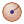 *Sphere: Centre & Radius* (*Sfera: središče & polmer*) za ustvarjanje krogle s središčem v točki $C$ in polmerom $r$. 
6. Premikajte točko $C$ oz. drsnik $r$, tako da se krogli sekajo. 
7. Z orodjem 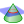 *Intersect two surfaces* (*Presečišče dveh ploskev*) ustvarite presečišče obeh krogli. To lahko naredite tudi z ukazom `Intersect(<krogla1>,<krogla2>)`.
8. Z orodjem 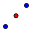 *Midpoint or Center* (*Sredina ali središče*), kliknite na presečišče krogel in ustvarite točko (recimo $D$).
9. Uporabite orodje  *Point on Object* (*Točka na objektu*) in kliknite na presečišče krogel, da ustvarite točko (recimo $E$), ki se lahko premika po krivulji presečišča.
10. Ustvarite daljico med točkama $D$ in $E$ z orodjem  *Segment* (*Daljica*) in spremenite njen oznak, tako da prikazuje njeno dolžino.
11. Animirajte točko $E$ vzdolž krivulje presečišča in opazujte, kako se dolžina daljice med točkama $D$ in $E$ spreminja. Če je potrebno, skrijte krogli, da bolje vidite krivuljo presečišča in točki $D$ in $E$.

**Katera krivulja je ustvarjena kot presečišče dveh krogli? Kakšna je odvisnost dolžine daljice med točkama $D$ in $E$ glede na polmer $r$ druge krogle?**
:::

::::{solution} ex-spheres
:class: tip dropdown
Konstrukcija v GeoGebri 3D je prikazana spodaj:

:::{code-cell} python
:tags: remove-input
IFrame("https://www.geogebra.org/material/iframe/id/wxj6e3br/width/1312/height/916/border/888888/sfsb/true/smb/false/stb/false/stbh/false/ai/false/asb/false/sri/false/rc/true/ld/false/sdz/true/ctl/false", width="570", height="398px", allowfullscreen=True)
:::

Lahko tudi jo odprite v [GeoGebri](https://www.geogebra.org/classic/wxj6e3br).

::::

Včasih je težko vse videti v 3D prostoru. Priporočamo, da eksperimentirate z različnimi pogledi in orodji za navigacijo v GeoGebri 3D. Vse najdete v  *Styling bar* (*Vrstici za spremenite sloga pogleda*). Če želite ročno spremeniti pogled, uporabite orodje 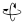 *Rotate View* (*Zasukaj pogled*) ali orodje 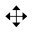 *Translate View* (*Premakni pogled*). 

## Premice in ravnine

:::{exercise} [Seznam vaj ⤵️ ](#10_geogebra3D_vaje)
:label: ex-distance
Kako izmeriti razdaljo medo točkama v GeoGebri 3D?

1. Ustvarite dve poljubni točki $A$ in $B$. Recimo da sta točki $A=(x_1,y_1,z_1)$ in $B=(x_2,y_2,z_2)$.
2. Ustvarite pravokotnik $R$ z oglišči $A=(x_1,y_1,z_1)$, $C=(x_2,y_1,z_1)$, $D=(x_2,y_2,z_1)$ in $E=(x_1,y_2,z_1)$ z orodjem 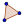 *Polygon* (*Poligon*). Namig: ukaz `x(A)` vrne $x$ koordinato točke $A$, `y(A)` vrne $y$ koordinato točke $A$ in `z(A)` vrne $z$ koordinato točke $A$.
3. Ustvarite prizmo $P$ z osnovo $P$ in višino $|z_2 - z_1|$, tako da druge štiri oglišča prizme so $B$, $F=(x_1,y_1,z_2)$, $G=(x_2,y_1,z_2)$ in $H=(x_1,y_2,z_2)$. To lahko naredite z orodjem 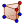 *Prism* (*Prizma*).
4. Z uporabo prizmo $P$, poiščite razdaljo med točkama $A$ in $B$, ki je enaka dolžini diagonale prizme $P$.
5. Poiščite formulo za razdaljo med poljubnima točkama v 3D, ki je podana z koordinatami $A=(x_1,y_1,z_1)$ in $B=(x_2,y_2,z_2)$. Zato, oglejte si pravokotna trikotnika $\triangle ACD$ in $\triangle ADB$ v prizmi $P$.
:::

::::{solution} ex-distance
:class: tip dropdown
1. Poljubne točki $A$ in $B$ lahko ustvarimo z ukazoma `A=(random(-5,5),random(-5,5),random(-5,5))` in `B=(random(-5,5),random(-5,5),random(-5,5))`. S tem bomo ustvarili točki z naključnimi koordinatami v območju od `-5` do `5`.
2. Točke $C$, $D$ in $E$ lahko ustvarimo z ukazi:
   - `C = (x(B), y(A), z(A))`
   - `D = (x(B), y(B), z(A))`
   - `E = (x(A), y(B), z(A))`
   Nato uporabimo orodje  *Polygon* (*Poligon*) za ustvarjanje pravokotnika $R$. Lahko tudi uporabimo ukaz `Polygon(D,C,A,E)`; pazite na vrstni red točk.
3. Z ukazom `Prism(R,B)` ustvarimo prizmo $P$ z osnovo $R$ in višino določeno z točko $B$; vrstni red točk je pomemben v prejšnjem koraku, saj je $D$ točka, ki je točno nad $B$. Zato lahko tudi uporabimo orodje  *Prism* (*Prizma*).
4. Ustvarimo trikotnika $\triangle ACD$ in $\triangle ADB$ z orodjem  *Polygon* (*Poligon*) oz. z ukazoma `Polygon(A,C,D)` in `Polygon(A,D,B)`.
5. Formula za razdaljo med točkama $A$ in $B$ v 3D prostoru je: $$d(A,B) = \sqrt{(x_2 - x_1)^2 + (y_2 - y_1)^2 + (z_2 - z_1)^2}.$$ To lahko vidimo iz Pitagorovega izreka, ki ga uporabimo dvakrat: najprej za trikotnik $\triangle ACD$ in nato za trikotnik $\triangle ADB$. 

Konstrukcija v GeoGebri 3D je prikazana spodaj:
:::{code-cell} python
:tags: remove-input
IFrame("https://www.geogebra.org/material/iframe/id/nga8tzfc/width/1512/height/916/border/888888/sfsb/true/smb/false/stb/false/stbh/false/ai/false/asb/false/sri/false/rc/true/ld/false/sdz/true/ctl/false", width="570", height="345px", allowfullscreen=True)
:::

Lahko tudi jo odprite v [GeoGebri](https://www.geogebra.org/classic/nga8tzfc).

::::

:::{exercise} [Seznam vaj ⤵️ ](#10_geogebra3D_vaje)
:label: ex-cube

1. Ustvarite ravnino z enačbo $ax + by + cz +d = 0$, kjer so $a$, $b$, $c$ in $d$ poljubne vrednosti (na primer, uporabite drsnike za določitev teh vrednosti).
2. Ustvarite kocko s središčem v izhodišču in tako da točka $(1,1,1)$ in $(-1,-1,-1)$ sta nasprotni oglišči kocke. 
3. Poiščite presečišče kocke in ravnine. To lahko naredite z orodjem  *Intersect two surfaces* (*Presečišče dveh ploskev*) ali z ukazom `Intersect(<kocka>,<ravnina>)`.
4. Kakšna je oblika presečišča kocke in ravnine? Poskusite z različnimi vrednostimi za koeficiente $a$, $b$, $c$ in $d$ v enačbi ravnine. Za katere vrednosti je presečišče:
    - prazen množica?
    - točka?
    - daljica?
    - kvadrat?
    - enakostranični trikotnik? (ali obstaja tak primer?)
    - pravni šestkotnik? (ali obstaja tak primer?)
:::

::::{solution} ex-cube
:class: tip dropdown
1. Ustvarimo točke $A=(1,1,1)$, $B=(-1,1,1)$ in $C=(-1,-1,1)$. Nato uporabimo ukaz `Cube(C,B,A)` (pazite na vrstni red točk) za ustvarjanje kocke s središčem v izhodišču.
2. Vnesite ukaz `ax+by+cz+d=0` v algebrsko okno. GeoGebra bo samodejno ustvarila drsnike za koeficiente $a$, $b$, $c$ in $d$.
3. Z ukazom `Intersect(<kocka>,<ravnina>)` poiščemo presečišče kocke in ravnine.
4. Oblika presečišča kocke in ravnine je odvisna od vrednosti koeficientov $a$, $b$, $c$ in $d$.

Lahko vidite konstrukcijo v GeoGebri 3D spodaj:

:::{code-cell} python
:tags: remove-input
IFrame("https://www.geogebra.org/material/iframe/id/pquesa7u/width/1512/height/884/border/888888/sfsb/true/smb/false/stb/false/stbh/false/ai/false/asb/false/sri/false/rc/true/ld/false/sdz/true/ctl/false", width="570", height="334", allowfullscreen=True)
:::

Lahko tudi jo odprite v [GeoGebri](https://www.geogebra.org/classic/pquesa7u).
::::

## Poliedri in drugi 3D objekti

::::{exercise} [Seznam vaj ⤵️ ](#10_geogebra3D_vaje)
:label: ex-polyhedra

Oglejte si datoteko GeoGebre spodaj, lahko jo tudi odprite v GeoGebri s klikom na [povezavo](https://www.geogebra.org/classic/gehhdz9r) in torej prenesite ga na svoj računalnik.

:::{code-cell} python
:tags: remove-input
IFrame("https://www.geogebra.org/material/iframe/id/gehhdz9r/width/1512/height/940/border/888888/sfsb/true/smb/false/stb/true/stbh/false/ai/true/asb/false/sri/true/rc/true/ld/false/sdz/false/ctl/false", width="570", height="340px", allowfullscreen=True)
:::

1. Z orodjem 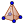 *Pyramid* (*Piramida*), ustvarite piramido nad petkotnikom. 
2. Z orodjem  *Prism* (*Prizma*), ustvarite prizmo nad trikotnikom. Opazite, da se miška mora premikati navpično, da določite višino prizme. Če ne je šlo in ste izgradili 2D obliko, uporabite orodje  *Move* (*Premakni*), da povlečete vrh prizme navzgor.
3. Izbrišite piramido in prizmo, ki ste jih ustvarili, in še enkrat jih ustvarite, tokrat z uporabo ukazov `Pyramid[<osnova>, <vrh>]` in `Prism[<osnova>, <višina>]`.
4. Z orodjem 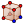 *Cube* (*Kocka*), ustvarite kocko z točkama $M$ in $N$ kot oglišči. To lahko storite z klikom na točki $M$ in $N$. Upoštevajte, da vrstni red točk je pomemben.
5. Premaknite tretjo točko kocke in jo obrnite tako, da bo zdaj pod sivo ravnino.
6. Orodje 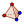 *Tetrahedron* (*Tetraedar*) deluje podobno kot orodje za kocko. Z njim zgradite tetraeder na odseku $PO$.
7. Z ukazom `Octahedron(R,Q)` lahko sestavite oktaeder s stranico $RQ$. Ta ukaz nima orodja v vrstici orodij. Ukaza `Dodecahedron` in `Icosahedron` lahko uporabite na podoben način za ustvarjanje dodekaedra in ikozaedra.
8. Z orodjem 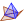 *Net* (*Mreža*), ustvarite mrežo za oktaeder. Kliknite na orodje in nato na oktaeder, ki ste ga ustvarili v koraku 6.
9. Z orodjem 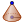 *Cone* (*Stožec*) kliknite na točko $I$ in nato na točko $J$. Ko vas GeoGebra vprašuje za polmer, vstavite $2$.
10. Orodje 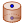 *Cylinder* (*Valj*) deluje podobno kot orodje za stožec. Uporabite ga za ustvarjanje valja, katerega os je daljica $KL$ in polmer je $2$. Prejšnji konstrukciji lahko naredite z ukaza `Cone(I,J,2)` in `Cylinder(K,L,2)`.

**Bonus**: Če GeoGebro uporabljate s tablici/telefonom, lahko s kamero projicirate objekte v razširjeni resničnosti.
::::

## Rotacijska ploskev

:::{exercise} [Seznam vaj ⤵️ ](#10_geogebra3D_vaje)
:label: ex-rotational-surfaces

1. Ustvarite drsnike `a`, `b` in `c` z vrednostmi od `-5` do `5` in korakom `0.01`. 
2. Ustvarite točko $A$ z koordinatami $(a,b,0)$ in točko $B$ z koordinatami $(0,3,0)$.
3. Z ukazom `f=Segment(A,B)` ustvarite daljico med točkama $A$ in $B$. To lahko naredite tudi z orodjem  *Segment* (*Daljica*).
4. Ustvarite drsnik `r` z lastnostmi `Min=0`, `Max=2*pi` in `Increment=0.01`.
5. Z ukazom `Surface(f,r,xAxis)` ustvarite rotacijsko ploskev, ki nastane z vrtenjem daljice $f$ okoli osi $x$.
6. Premikajte drsnike $a$ in $b$ ter opazujte, kako se spreminja rotacijska ploskev. Kakšna je ploskev, ko je $a=0$? Kaj se zgodi, ko je $b=0$?
---
7. Ustvarite točko $C$ z koordinatami $(a,3,c)$ in daljico $g=BC$ (ukaz je `g=Segment(B,C)`).
8. Ustvarite rotacijsko ploskev z vrtenjem daljice $g$ okoli osi $z$. Kateri ukaz uporabite?
9. Premikajte drsnike $a$ in $c$ v različne položaje in opazujte nastale rotacijske ploskve. A so nastale ploskve še vedno deli stožca? 
---
10. Z ukazom `l=(2,t,0)` ustvarite premico $l$ vzporedno z osijo $y$ in skozi točko $(2,0,0)$.
11. Z ukazom `k=Circle(l,(1,0,0))` ustvarite krožnico $k$, katerega os je premica $l$ in polmer je `1`. Upoštevajte, da v 3D prostoru, krožnico določata os in polmer; središče in polmer določata kroglo.
12. Z ukazom `Surface(k,r, zAxis)` ustvarite rotacijsko ploskev z vrtenjem krožnice $k$ okoli osi $z$. Kakšen 3D objekt je nastal? Ta ploskev je znana kot torus (ali "krofasta površina").
:::

Drugi način za prikaz rotacijske ploskve je z orodjem 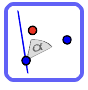 *Rotate around Line* (*Vrtenje okoli premice*).

:::{exercise} [Seznam vaj ⤵️ ](#10_geogebra3D_vaje)
:label: ex-rotate-funkcije
1. Z ukazom `f(x)=sin(x)` ustvarite funkcijo $f(x)=\sin(x)$.
2. Ustvarite drsnik `t` z lastnostmi `Min=0`, `Max=2*pi` in `Increment=0.01`. Nastavite Polje `Repeat` na `Increasing (Once)`. 
3. Kliknite na graf funkcije $f$ z desnim klikom in izberite možnost *Show trace*.
4. Z orodjem  *Rotate around Line* (*Vrtenje okoli premice*), izberite graf funkcije $f$ in nato os $x$ kot os vrtenja. Nastavite kot vrtenja na drsnik `t`.
5. Animirajte drsnik `t` in opazujte nastalo rotacijsko ploskev. Kateri 3D objekt je nastal?
---
6. Ustvarite drsnik `t` z lastnostmi `Min=0.1`, `Max=10` in `Increment=0.01`.
7. Z ukazom `g(x)=1/x` ustvarite funkcijo $g(x)=\frac{1}{x}$.
8. Z ukazom `Surface(g,r,xAxis)` ustvarite rotacijsko ploskev z vrtenjem grafa funkcije $g$ okoli osi $x$. Kakšen 3D objekt je nastal? A se ste spomnili tega objekta?
9. Odprite *Menu > View*  in izberite 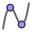 Algebra (tako da algebrsko okno se skrije) in izberite 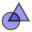 Graphics`. V tem pogledu vidimo ravnino $xy$ in krivuljo, ki je nastala z vrtenjem grafa funkcije $g$ okoli osi $x$.
10. Premikanje drsnika `t` in opazujte, kako se spreminja krivulja v ravnini $xy$.
:::

## Funkcije z več spremenljivkami.

:::{exercise} [Seznam vaj ⤵️ ](#10_geogebra3D_vaje)
:label: ex-multivariable-functions
1. Z ukazom `f(x,y)=sin(x+y)` ustvarite funkcijo z dvema spremenljivkama $f(x,y)=\sin(x+y)$.
2. Odprite pogled *Graphics* kot v koraku 9. [prejšnje vaje](#ex-rotate-funkcije).
3. V pogledu *Graphics* ustvarite točko $A$. 
4. Ustvarite točko $B$ z ukazom `B=(x(A),y(A),f(x(A),y(A)))`. Točka $B$ leži na površini funkcije $f$ nad točko $A$ v ravnini $xy$.
5. Ustvarite daljico med točkama $A$ in $B$ z orodjem  *Segment* (*Daljica*) oz. z ukazom `Segment(A,B)`.
6. Premikajte točko $A$ v ravnini $xy$ in opazujte, kako se spreminja višina točke $B$ in dolžina daljice med točkama $A$ in $B$.
:::

(10_geogebra3D_vaje)=
## Vaje

- [ ] [Vaja %s.](#ex-spheres): Ustvarite dve krogli v GeoGebri 3D in raziskujte njihovo presečišče.
- [ ] [Vaja %s.](#ex-distance): Kako izmeriti razdaljo medo točkama v GeoGebri 3D?
- [ ] [Vaja %s.](#ex-cube): Ustvarite kocko in ravnino v GeoGebri 3D ter poiščite njihovo presečišče.
- [ ] [Vaja %s.](#ex-polyhedra): Ustvarite različne poliedre in 3D oblike v GeoGebri 3D.
- [ ] [Vaja %s.](#ex-rotational-surfaces): Ustvarite rotacijske ploskve v GeoGebri 3D z vrtenjem daljic in krožnic okoli osi.
- [ ] [Vaja %s.](#ex-rotate-funkcije): Ustvarite rotacijske ploskve z vrtenjem grafov funkcij okoli osi v GeoGebri 3D.
- [ ] [Vaja %s.](#ex-multivariable-functions): Raziščujte funkcije z več spremenljivkami v GeoGebri 3D.
